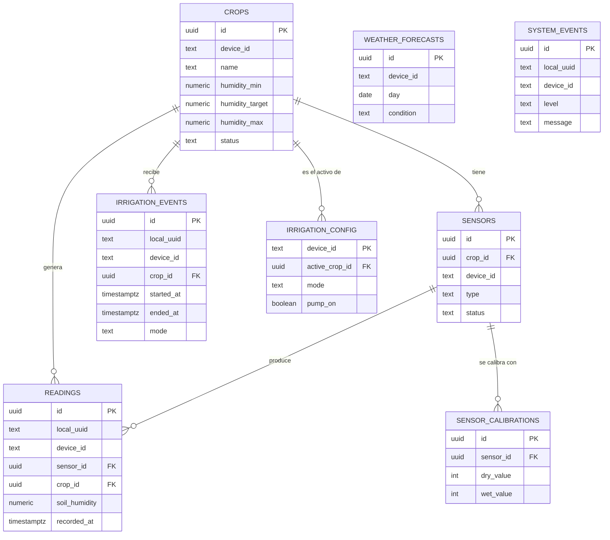

# EcoSmart — Base de datos

Este documento explica el diseño de la base de datos del proyecto: por qué se
tomó cada decisión, cómo están relacionadas las tablas, y qué buenas
prácticas se aplicaron. Hay **dos** bases de datos en este proyecto, con
propósitos distintos:

| | SQLite (local) | PostgreSQL (Supabase) |
|---|---|---|
| Dónde vive | `raspberry/database/ecosmart.db` | Proyecto en la nube de Supabase |
| Para qué | Que la Raspberry Pi siga funcionando **sin internet** | Fuente de verdad que consulta la app web |
| Quién la usa | Solo el agente Python | La app web (lectura/escritura) y el agente Python (solo escritura, vía sync) |
| Esquema | [`raspberry/database/schema.sql`](../raspberry/database/schema.sql) | [`schema-reference.sql`](./schema-reference.sql) (este mismo folder) |

La razón de tener dos: un sensor no puede depender de que haya internet para
guardar una lectura. Por eso el agente **siempre** escribe primero en SQLite
(rápido, local, cero dependencias de red) y luego, si hay conexión, sube lo
pendiente a Supabase. Es el patrón *offline-first*.

## Diagrama entidad-relación (Supabase / Postgres)



`WEATHER_FORECASTS` y `SYSTEM_EVENTS` no tienen llave foránea hacia `crops`
a propósito: son datos a nivel de *dispositivo*, no de cultivo específico.

## Decisiones de diseño y por qué

### 1. `device_id` como llave de particionamiento (en vez de `user_id`)

Todas las tablas se filtran por `device_id` (texto, ej. `ecosmart-pi-01`), no
por usuario. Es una decisión deliberada de esta fase del proyecto: el login
todavía es de demostración (sin Supabase Auth activo), así que no existe un
`auth.uid()` real con el cual filtrar. `device_id` modela correctamente el
dominio real del problema: **una Raspberry Pi controla una finca**, y varias
personas de esa finca podrían compartir el mismo dispositivo. Cuando se
active Supabase Auth (Fase 4), `crops.user_id` ya existe y está listo para
usarse junto con `device_id` (una finca, varios cultivos, varios usuarios).

### 2. UUID como llave primaria, no `SERIAL`/enteros autoincrementales

Los IDs se generan con `gen_random_uuid()`, no con contadores. Esto importa
específicamente porque el agente de la Raspberry Pi genera un `local_uuid`
**en SQLite, sin conexión**, antes de saber si va a poder sincronizar. Con
enteros autoincrementales dos dispositivos (o el mismo dispositivo
reinstalado) podrían generar el mismo ID y chocar al sincronizar. Con UUID
eso no puede pasar.

### 3. `local_uuid` + índice único parcial = sincronización idempotente

```sql
create unique index if not exists idx_readings_local_uuid
  on readings (local_uuid) where local_uuid is not null;
```

Si el agente Python sube una lectura y la conexión se corta justo después
(nunca recibe la confirmación), al reintentar mandaría la misma fila dos
veces. El índice único sobre `local_uuid` evita duplicados aunque eso pase.
Es parcial (`where local_uuid is not null`) porque filas creadas directamente
desde la app web no tienen `local_uuid` y no deben chocar entre sí por tenerlo
en `NULL`.

### 4. `CHECK` constraints en vez de solo validar en el frontend

Rangos de humedad (0-100), coherencia de umbrales
(`humidity_min <= humidity_target <= humidity_max`), duraciones positivas,
etc. están validados **en la base de datos**, no solo en el formulario de
React. Un formulario se puede saltar (llamando a la API directo, o con un
bug futuro); un `CHECK` constraint no.

### 5. Row Level Security (RLS)

Todas las tablas tienen RLS activado. En esta fase de demostración las
políticas son abiertas (ver [`rls-demo-policies.sql`](./rls-demo-policies.sql)),
pero la estructura ya está lista para endurecerse: cuando se active Supabase
Auth, cada política pasa de `using (true)` a algo como
`using (device_id in (select device_id from user_devices where user_id = auth.uid()))`
sin tener que tocar el esquema de las tablas.

### 6. Índices alineados a los patrones de consulta reales, no "por si acaso"

Cada índice de [`schema-reference.sql`](./schema-reference.sql) corresponde
a una consulta que la app realmente hace (ver
[`src/lib/api.ts`](../src/lib/api.ts)):

- `idx_readings_device_recorded` → `useReadings()` siempre filtra por
  `device_id` y ordena por `recorded_at desc`.
- `idx_irrigation_events_open` (índice parcial `where ended_at is null`) →
  `useStopManualIrrigation()` busca "el evento abierto más reciente"; con
  miles de eventos históricos, este índice evita escanear toda la tabla.
- `unique(device_id, day)` en `weather_forecasts` → evita pronósticos
  duplicados si el script de carga se corre dos veces.

### 7. Serie de tiempo separada de la configuración

`readings` (que crece sin parar, una fila por lectura) está separada de
`irrigation_config` (una fila fija por dispositivo que se actualiza in-place).
Mezclarlas habría significado o bien reescribir configuración en cada
lectura (desperdicio) o buscar la "última fila" de una tabla enorme cada vez
que se necesita saber el modo actual (lento). Son dos patrones de acceso
distintos y por eso son dos tablas distintas.

### 8. Offline-first: SQLite local nunca depende de Supabase

El esquema de SQLite (`raspberry/database/schema.sql`) es deliberadamente más
simple (sin UUID nativos, con `synced INTEGER DEFAULT 0` en vez de RLS). No
necesita replicar toda la complejidad de Postgres porque su único trabajo es
sobrevivir cortes de internet; la validación estricta y las relaciones viven
en Supabase, que es la fuente de verdad.

## Cómo se sincronizan

```
Sensor/simulador → SQLite (siempre, con local_uuid + synced=0)
                       │
                       │ cada 60s, si hay internet
                       ▼
                  POST a Supabase (PostgREST)  →  marca synced=1 solo si 2xx
```

Ver [`raspberry/sync/sync_manager.py`](../../../raspberry/sync/sync_manager.py)
para la implementación. Si una subida falla, la fila se queda como pendiente
y se reintenta en el siguiente ciclo — no se pierde nada localmente.

## Archivos de este folder

| Archivo | Para qué |
|---|---|
| `schema-reference.sql` | Recrear el esquema de Postgres desde cero (llaves foráneas, checks, índices, comentarios) |
| `seed-demo-data.sql` | Datos de ejemplo para que el dashboard no se vea vacío |
| `rls-demo-policies.sql` | Políticas RLS abiertas, solo para esta etapa de demostración |
