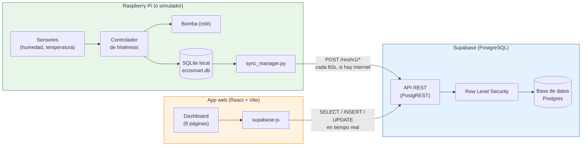
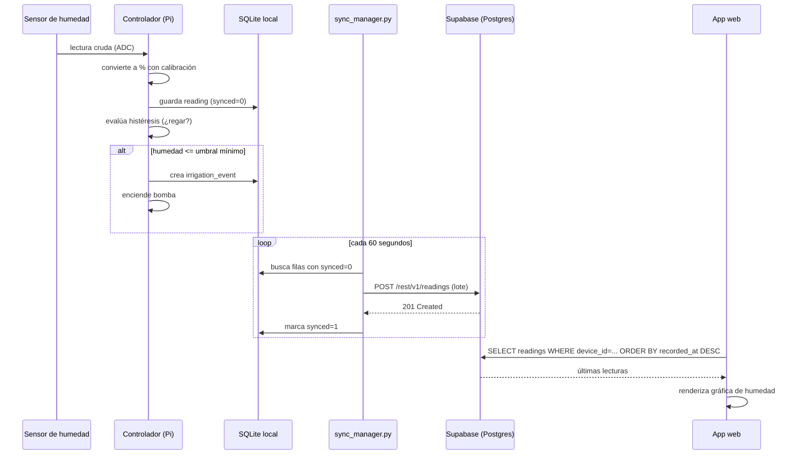
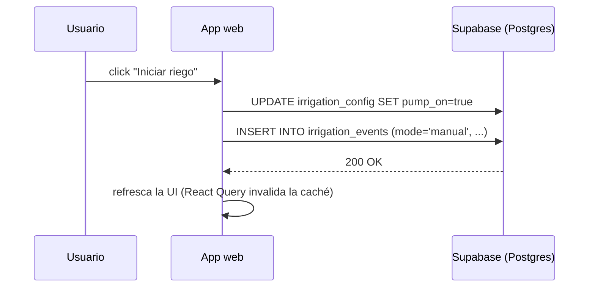

# EcoSmart — Arquitectura del proyecto

EcoSmart tiene tres componentes independientes que se comunican entre sí a
través de una base de datos compartida (Supabase). Ninguno de los tres
depende de que los otros dos estén corriendo en el mismo momento — es una
arquitectura desacoplada a propósito, pensada para que el sistema de riego
siga funcionando aunque, por ejemplo, no haya nadie viendo el dashboard.

## Vista general

**Idea central:** la Raspberry Pi y la app web nunca se hablan directamente
entre sí. Ambas hablan con Supabase, y Supabase es la única fuente de verdad
compartida. Esto significa que puedes apagar tu laptop (la app web) y el
riego automático en la Raspberry Pi sigue funcionando exactamente igual; o
viceversa, puedes ver el dashboard sin que la Raspberry esté prendida (solo
verías los últimos datos que mandó).

## Los tres componentes

### 1. Raspberry Pi — `raspberry/`

Es el "cerebro" físico del riego: lee sensores, decide cuándo regar, y
controla la bomba. Corre de forma continua e independiente.

| Módulo | Responsabilidad |
|---|---|
| `sensors/` | Leer humedad de suelo (vía ADS1115) y temperatura (DS18B20) |
| `actuators/pump.py` | Encender/apagar el relé de la bomba, con límite de seguridad de tiempo máximo encendida |
| `irrigation/hysteresis.py` | Máquina de estados: decide *cuándo* empezar/parar el riego según los umbrales del cultivo |
| `irrigation/controller.py` | Orquesta sensores + histéresis + bomba en cada ciclo |
| `database/` | SQLite local — persiste todo aunque no haya internet |
| `sync/sync_manager.py` | Sube a Supabase lo que está pendiente (`synced = 0`), cada 60 segundos |
| `simulator/` | Sensores y clima simulados, para probar sin hardware físico |
| `main.py` | Punto de entrada: arranca el loop principal |

**Por qué SQLite local primero:** un sistema de riego no puede depender de
que haya wifi. Cada lectura y cada evento de riego se guarda localmente de
inmediato; la sincronización a la nube es un paso *adicional*, no un
requisito para que el riego funcione. Ver el porqué completo en
[`schema-reference.sql` y `DATABASE.md`](../BD%20proy/ecosmart-fields-main/supabase/DATABASE.md).

### 2. Supabase — base de datos + API

No hay backend propio (Node/Express) escrito para este proyecto: Supabase
genera automáticamente una API REST (PostgREST) sobre las tablas de
Postgres. Tanto la Raspberry Pi como la app web hablan con esa API
directamente, cada una con la clave pública ("anon key") protegida por
Row Level Security.

| Pieza | Qué hace |
|---|---|
| Tablas (`crops`, `sensors`, `readings`, `irrigation_events`, `irrigation_config`, `sensor_calibrations`, `weather_forecasts`, `system_events`, `profiles`) | Esquema completo en [`schema-reference.sql`](../BD%20proy/ecosmart-fields-main/supabase/schema-reference.sql) |
| Row Level Security (RLS) | Controla quién puede leer/escribir cada tabla — ver [`rls-demo-policies.sql`](../BD%20proy/ecosmart-fields-main/supabase/rls-demo-policies.sql) |
| PostgREST | Convierte cada tabla en endpoints REST automáticamente (`/rest/v1/readings`, etc.) — no hay que escribir controladores a mano |

### 3. App web — `BD proy/ecosmart-fields-main/`

Dashboard construido con React + Vite + TanStack Router + TanStack Query +
Tailwind + shadcn/ui. Se conecta a Supabase directamente desde el navegador
con `@supabase/supabase-js` — no hay servidor intermedio propio.

| Módulo | Responsabilidad |
|---|---|
| `src/lib/supabaseClient.ts` | Cliente de Supabase (URL + anon key desde `.env`) |
| `src/lib/types.ts` | Tipos TypeScript que reflejan el esquema real de Postgres |
| `src/lib/api.ts` | Hooks de datos (`useCrops`, `useReadings`, `useIrrigationConfig`, mutaciones para iniciar/detener riego, etc.), usando TanStack Query |
| `src/routes/dashboard.*.tsx` | Las 8 páginas del dashboard (Panel general, Riego, Cultivos, Monitoreo, Clima, Historial, Sensores, Configuración) |
| `src/components/eco/` | Componentes propios (header de página, tarjetas de estado, badges) |
| `src/components/ui/` | Componentes base de shadcn/ui |

## Flujo de datos: de un sensor al dashboard

## Flujo de datos: acción manual desde el dashboard

Este caso es distinto: la app web escribe directo en Supabase, sin pasar
por la Raspberry Pi. Por eso el botón "Iniciar riego" desde el dashboard
**no mueve una bomba física** a menos que haya un agente corriendo en modo
`HARDWARE_MODE=real` que además lea `irrigation_config` de vuelta (mejora
pendiente para una fase futura — ver limitaciones en `SETUP.md`).

## Decisiones de arquitectura y por qué

- **Sin backend propio (Node/Express):** Supabase + PostgREST + RLS cubre
  exactamente lo que un backend a medida haría para este proyecto (API REST
  + autenticación + reglas de acceso), sin tener que escribir ni desplegar
  un servidor aparte. Ver la discusión completa de esta decisión en la
  sección de estado del [`README.md`](../README.md) principal.
- **`device_id` en vez de sesiones de usuario:** todas las tablas se
  particionan por dispositivo, no por usuario (el login todavía es de
  demostración). El diseño ya deja espacio para usuarios reales
  (`crops.user_id`) cuando se active Supabase Auth.
- **Offline-first en la Raspberry Pi:** ver la sección "8. Offline-first" en
  [`DATABASE.md`](../BD%20proy/ecosmart-fields-main/supabase/DATABASE.md).
- **Simulador intercambiable:** `simulator/simulator.py` implementa la
  misma interfaz que los sensores/bomba reales, así que `HARDWARE_MODE` es
  literalmente el único cambio necesario para pasar de probar en una laptop
  a correr en hardware físico.

## Documentos relacionados

| Documento | Contenido |
|---|---|
| [`README.md`](../README.md) | Estado del proyecto y estructura de carpetas |
| [`SETUP.md`](../SETUP.md) | Cómo poner todo a correr paso a paso |
| [`BD proy/ecosmart-fields-main/supabase/DATABASE.md`](../BD%20proy/ecosmart-fields-main/supabase/DATABASE.md) | Diseño detallado de la base de datos |
